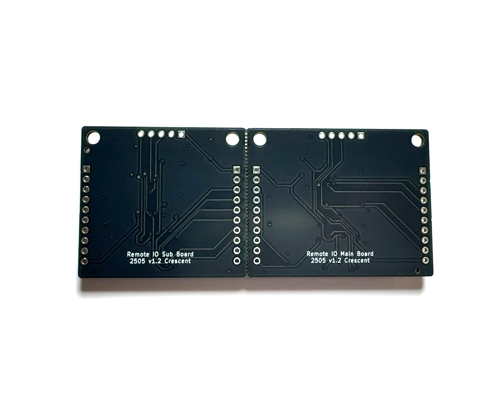

# リモートIO基板
# Remote IO Board
Remote IO Board with Shift Register 

## 概要 
  * 本基板はIO信号をシリアル化してメイン基板とサブ基板間で同期する基板です  
  * ボタンやLED等のユーザ入出力の配線を省配線化する際に便利です  
  * 本基板はマイコンやFPGA等を使用せず、シフトレジスタ、タイマ、カウンタ等の論理ICのみで構成されています  
  * メイン基板、サブ基板ともにそれぞれ8本の入力と出力を備えており、メイン基板とサブ基盤間で各信号のON/OFF状態が同期されます  
  * 8入力/8出力の信号をそのまま伝送すると計16本の信号線が必要ですが、本基板を使用すると信号線3本のみで伝送することが可能です（同期クロック＋シリアルデータx2）  
  * 片方向のみの場合は信号線2本のみで伝送することが可能です（同期クロック＋シリアルデータx1※D0 or D1を未接続）  
  * 各入出力の動作確認用にそれぞれボタン及びLEDを備えています  

## 仕様
  * 電源電圧DC2V~5.5V  
  * 各基板8入力/8出力  
  * メイン基板とサブ基板の電源は同一の電源電圧を供給してください  
  * 約1kHzの周期で双方向に同期します(内部クロック約8kHz、8bit+同期1bit)  
  * 入力ポートは基板内部でプルダウンされています  
  * メイン基板とサブ基板の伝送距離は最大数m程度を想定しています  

## 使用方法
  * メイン基板とサブ基板のSCK同士、D0同士、D1同士をケーブルで接続します
  * 片方向のみで使用する場合はD0もしくはD1のどちらかを未接続で使用します
  * メイン基板とサブ基板のVCCとGNDに電源を接続します
  * 必要に応じてIN0-15にスイッチ、OUT0-15にLED等を配線してください
  * 基板内部でプルダウンされているため、未使用の入力は未接続で使用します
    

## 注意 
  * ON/OFFのデジタル信号が同期されます。アナログ信号の同期はできません
  * メイン基板とサブ基板で電源電圧が異なる場合は電圧レベル変換IC等で信号線を変換してください
  * 電源投入直後は同期状態や出力が不安定な場合があります
  * 伝送距離が長い場合やノイズ環境下等では信号同期が安定しない場合があります
  * ノイズ環境下や長い伝送距離の場合は必要に応じて、ダンピング抵抗やシールドケーブル、フォトカプラ等でノイズ対策を行ってください
  * 高い信頼性が求められる用途には使用しないでください
  * メイン基板とサブ基板は必要に応じて分離して使用してください
  * 分離の際や分離後のエッジ部分は鋭利なため、怪我をしないように注意してください  

MIT Lisense
